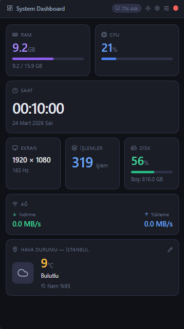
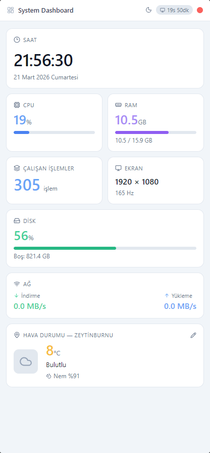
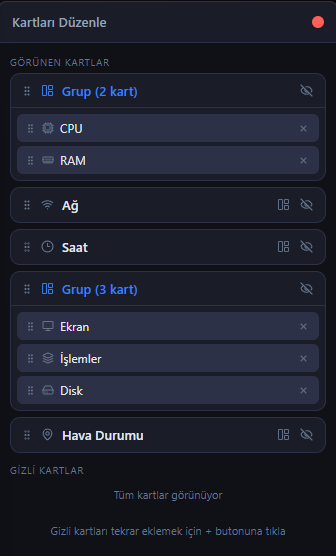
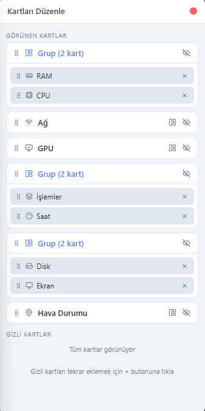
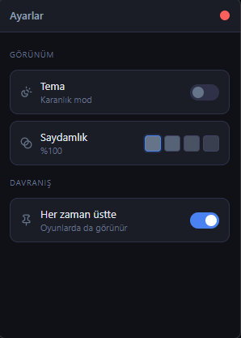
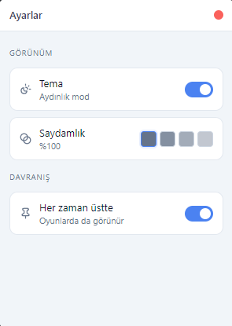

# System Dashboard

Masaüstünde her zaman üstte duran, gerçek zamanlı sistem bilgilerini gösteren bir Electron uygulaması.


## Ekran Görüntüleri

### Ana Widget
| Karanlık Mod | Aydınlık Mod |
|---|---|
|  |  |

### Kart Düzenleyici
| Karanlık Mod | Aydınlık Mod |
|---|---|
|  |  |

### Ayarlar
| Karanlık Mod | Aydınlık Mod |
|---|---|
|  |  |

## Özellikler

### Sistem Bilgileri
- 🖥️ Gerçek zamanlı CPU & RAM kullanımı
- 💾 Disk kullanımı ve boş alan
- 🌐 Ağ hızı (indirme / yükleme)
- ⚙️ Açık işlem sayısı
- 🖥️ Ekran çözünürlüğü & yenileme hızı
- 🌤️ Hava durumu (şehir seçilebilir)
- 🕐 Saat & tarih
- ⏱️ Sistem uptime

### Özelleştirme
- 🃏 Kartları sürükleyerek yeniden sırala
- 👁️ İstediğin kartları gizle / göster
- 🔲 Kartları yan yana grupla (compact mod)
- 🌙 Aydınlık / Karanlık mod
- 📐 Kenardan sürükleyerek boyutlandır (orantılı ölçekleme)

### Ayarlar Penceresi
- 📌 Her zaman üstte kal (oyun modu dahil)
- 🫥 Saydamlık (4 farklı opaklık seviyesi)
- 🌙 Tema değiştirme

### Performans
- Hafif veriler (CPU, RAM) 4 saniyede bir güncellenir
- Ağ verisi 10 saniyede bir güncellenir
- Disk & işlem sayısı 15-30 saniyede bir güncellenir
- Push modeli ile IPC spam önlenir
- Ekran bilgisi, disk ve işlem sayısı cache'lenerek gereksiz sorgular azaltılır

## Kurulum

### Gereksinimler
- [Node.js](https://nodejs.org) (LTS)
- [Git](https://git-scm.com)

### Adımlar

```bash
# Repoyu klonla
git clone https://github.com/AbdullahEminEsen/system-dashboard.git

# Klasöre gir
cd system-dashboard

# Bağımlılıkları yükle
npm install

# Uygulamayı başlat
npm start
```

### Build (Kurulum dosyası oluştur)

```bash
npm run build
```

`dist` klasöründe `System Dashboard Setup x.x.x.exe` dosyası oluşur.

## Kullanım

| Buton | İşlev |
|---|---|
| ☀️ / 🌙 | Aydınlık / Karanlık mod geçişi |
| ⚙️ | Ayarlar penceresini aç |
| ⠿ | Kart düzenleyiciyi aç |
| ✕ | Uygulamayı kapat |

### Kart Düzenleyici
- Kartları sürükleyerek sırala
- Göz ikonuyla kartları gizle veya göster
- Panel ikonu ile iki kartı yan yana grupla
- Gizli kartları tekrar ekle

### Boyutlandırma
Pencerenin kenarından tutup sürükleyerek genişletebilir veya daraltabilirsin. İçerik orantılı olarak ölçeklenir.

### Ayarlar
- **Tema** — Aydınlık / Karanlık mod toggle
- **Saydamlık** — 4 farklı opaklık seviyesi (%100, %80, %60, %40)
- **Her zaman üstte** — Oyunlar dahil tüm pencerelerin üzerinde kalır

## Kullanılan Teknolojiler

| Teknoloji | Açıklama |
|---|---|
| [Electron](https://www.electronjs.org/) | Masaüstü uygulama çatısı |
| [systeminformation](https://systeminformation.io/) | Sistem bilgisi okuma |
| [electron-store](https://github.com/sindresorhus/electron-store) | Ayarların kalıcı kaydı |
| [axios](https://axios-http.com/) | HTTP istekleri |
| [Open-Meteo API](https://open-meteo.com/) | Ücretsiz hava durumu API'si |
| [Lucide Icons](https://lucide.dev/) | İkon seti |
| [SortableJS](https://sortablejs.github.io/Sortable/) | Sürükle bırak |

## Lisans

MIT
