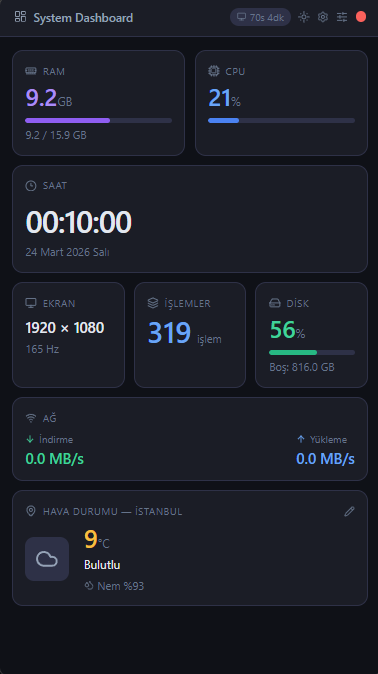
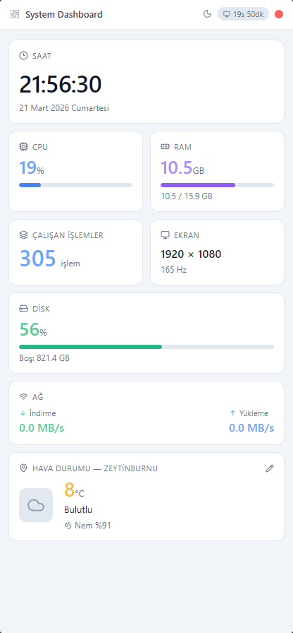
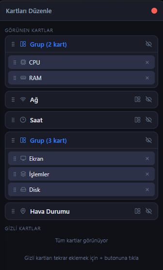
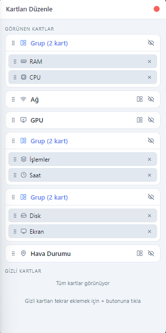
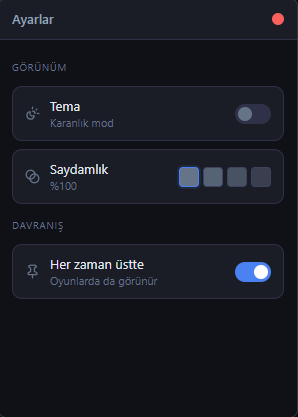
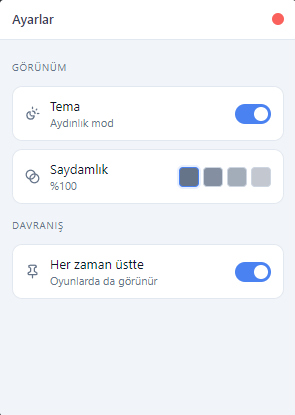

# System Dashboard

A lightweight Electron-based desktop widget that displays real-time system information, always sitting on top of your other windows.


## Screenshots

### Main Widget
| Dark Mode | Light Mode |
|---|---|
|  |  |

### Card Editor
| Dark Mode | Light Mode |
|---|---|
|  |  |

### Settings
| Dark Mode | Light Mode |
|---|---|
|  |  |

## Download

Head over to the [Releases](https://github.com/AbdullahEminEsen/system-dashboard/releases) page to download the latest version.

| File | Description |
|---|---|
| `System Dashboard Setup x.x.x.exe` | Windows installer (recommended) |
| `System Dashboard x.x.x.exe` | Windows portable, no installation needed |
| `System Dashboard-x.x.x.AppImage` | Linux |

> **⚠️ Windows:** You may see a SmartScreen warning. Click **"More info"** → **"Run anyway"**. The app is open source and safe to install.

> **🐧 Linux:** Tested on Debian 12. Transparency is not supported on Wayland sessions without a compositor.

## Features

### System Info
- 🖥️ Real-time CPU & RAM usage
- 💾 Disk usage and free space
- 🌐 Network speed (download / upload)
- ⚙️ Running process count
- 🖥️ Screen resolution & refresh rate (multi-display support)
- 🎮 GPU usage, temperature, VRAM & power draw
- 🕐 Clock & date
- ⏱️ System uptime

### Customization
- 🃏 Drag cards to reorder
- 👁️ Show / hide individual cards
- 🔲 Group cards side by side (compact mode)
- 🌙 Light / Dark mode
- 📐 Drag window edges to resize (proportional scaling)
- 🖥️ Select active GPU and display from a dropdown

### Stress Benchmark
- 🔥 CPU and/or GPU stress test with selectable load level and duration
- 📈 Live CPU/GPU load, temperature and power charts
- 🛡️ Automatic thermal safety cutoff (stops if a temperature gets dangerous)
- 💾 Export the full report as JSON
- ⚡ GPU selection (discrete / integrated) for hybrid-graphics laptops

### Settings Panel
- 📌 Always on top (works in games too)
- 🫥 Transparency (4 opacity levels)
- 🌙 Theme toggle
- 🌍 Language (Turkish / English)

### System Tray
- App runs in the background when closed
- Click tray icon to show / hide the widget
- Right-click for quick access to Settings and Card Editor

## Performance

The widget is built to be light on resources:

- **CPU load, RAM and uptime** are read directly from the OS (`os` module) — no external processes are spawned for the frequent updates.
- **GPU, process count and disk** use a small optional native add-on (see below) so they don't shell out to `wmic` / `nvidia-smi` / `tasklist`; when the add-on isn't built they fall back to `systeminformation`.
- Polling is a **self-scheduling loop** (the next tick is scheduled only after the previous one finishes, so calls never pile up) and **pauses entirely while the widget is hidden** in the tray.
- Heavy probes are throttled (GPU/temperature ~20 s, processes/disk ~60 s, network ~15 s); the light heartbeat runs every 5 s.

## GPU support

GPU metrics are read natively per vendor, with a graceful fallback:

| Vendor | Source | Usage | VRAM | Temp | Power |
|---|---|---|---|---|---|
| NVIDIA | NVML (`nvml.dll`) | ✅ | ✅ | ✅ | ✅ |
| AMD | PDH counters + ADL (`atiadlxx.dll`) | ✅ | ✅ | ✅ | ✅ |
| Intel | PDH counters | ✅ | ✅ | — | — |

This requires the native add-on to be built (see below). Without it, GPU data falls back to `systeminformation` (name only on non-NVIDIA cards).

## Installation (from source)

### Requirements
- [Node.js](https://nodejs.org) (LTS or newer)
- [Git](https://git-scm.com)
- **For the native GPU add-on (optional but recommended):**
  - Windows: [Visual Studio Build Tools](https://visualstudio.microsoft.com/downloads/) with the **"Desktop development with C++"** workload, plus **Python 3**

### Steps

```bash
# Clone the repository
git clone https://github.com/AbdullahEminEsen/system-dashboard.git
cd system-dashboard

# Install dependencies
npm install

# (Optional) build the native metrics add-on for native GPU / process / disk data
npm run build:native

# Start the app
npm start
```

> The native add-on is optional. If it isn't built, the app still runs and falls back to `systeminformation` — you just won't get native GPU stats on non-NVIDIA cards. The add-on uses N-API, so it does **not** need to be rebuilt for each Electron version.

### Build

```bash
npm run build:native   # compile the native add-on first (so it's bundled)
npm run build          # produce the installer / portable exe in dist/
```

The output is generated in the `dist` folder.

## Usage

| Button | Action |
|---|---|
| ☀️ / 🌙 | Toggle light / dark mode |
| ⚙️ | Open settings |
| ⠿ | Open card editor |
| ✕ | Minimize to tray |

### Card Editor
- Drag slots to reorder cards
- Toggle visibility with the eye icon
- Group two cards side by side using the panel icon
- Re-add hidden cards from the pool below

### Resizing
Drag any edge of the window to resize. The content scales proportionally.

### Settings
- **Theme** — Toggle between light and dark mode
- **Opacity** — Choose from 4 transparency levels (100%, 80%, 60%, 40%)
- **Always on top** — Stay above all windows, including fullscreen games
- **Language** — Turkish / English

### System Tray
The app minimizes to the system tray when closed. Click the tray icon to show or hide the widget. Right-click for quick access to Settings, Card Editor, and Quit.

## Tech Stack

| Technology | Purpose |
|---|---|
| [Electron](https://www.electronjs.org/) | Desktop app framework |
| [systeminformation](https://systeminformation.io/) | System data access (fallback) |
| [electron-store](https://github.com/sindresorhus/electron-store) | Persistent settings storage |
| [node-addon-api](https://github.com/nodejs/node-addon-api) | Native add-on (NVML / PDH / ADL for GPU, EnumProcesses) |
| [Lucide Icons](https://lucide.dev/) | Icon set |
| [SortableJS](https://sortablejs.github.io/Sortable/) | Drag and drop |
| [Chart.js](https://www.chartjs.org/) | Benchmark charts |

## License

MIT
